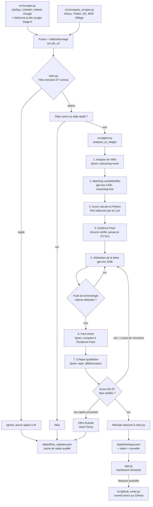

# 💼 MatchCraft AI

Agent perso qui scanne le web à la recherche de **stages et alternances** en **Data Science, Analytics, Machine Learning, LLM et AI Engineering**, et rédige pour chaque offre pertinente une **lettre de motivation personnalisée**, ancrée dans mon CV, mon portfolio et mes projets GitHub — sans inventer de fait, de métrique ou de technologie absente de mon dossier.

> Repo privé pour l'instant. Une version open-source (config externalisée, onboarding pour d'autres profils) est prévue séparément plus tard — ce README documente l'architecture et le fonctionnement réels du projet actuel.

---

## Sommaire

- [Vue d'ensemble du pipeline](#vue-densemble-du-pipeline)
- [1. Collecte des offres](#1-collecte-des-offres)
- [2. Filtrage domaine/contrat](#2-filtrage-domainecontrat)
- [3. Le cœur du système : `src/agent.py`](#3-le-cœur-du-système-srcagentpy)
- [4. Persistance & anti-doublons](#4-persistance--anti-doublons)
- [5. Restitution : dashboard Streamlit](#5-restitution--dashboard-streamlit)
- [Automatisation](#automatisation)
- [Config actuelle](#config-actuelle)
- [Points de vigilance actuels](#points-de-vigilance-actuels)
- [Prochaines pistes](#prochaines-pistes)

---

## Vue d'ensemble du pipeline



Le pipeline complet tient en 5 grandes zones, détaillées ci-dessous.

---

## 1. Collecte des offres

**`src/scraper.py`** — interroge JobSpy (qui scrape LinkedIn, Indeed, Google) plus Welcome to the Jungle et Stage.fr, en croisant une liste de termes de recherche (`SEARCH_TERMS`) avec une liste de villes (`CITIES`). Les termes sont volontairement resserrés sur mon positionnement réel (Finance/Risque/Fraude, Industrie/Énergie, RAG/LLM) plutôt que génériques ("Data Analyst", "AI Intern") — des termes trop larges ramènent beaucoup d'offres hors-scope (BI, marketing...) qui seraient de toute façon rejetées plus loin, mais en gaspillant du temps de scraping et des appels LLM inutiles.

ZipRecruiter a été retiré de la liste des sites JobSpy : son WAF Cloudflare bloque systématiquement les IPs de datacenter GitHub Actions (403 `forbidden cf-waf`), sans contournement gratuit fiable.

**`src/company_scraper.py`** — interroge directement les endpoints internes (non documentés officiellement) des portails carrière de grands groupes : Airbus (jobs2web), Thales (Workday), Société Générale, BNP Paribas (SmartRecruiters), Eiffage. Ces endpoints ont été identifiés en inspectant l'onglet Réseau du navigateur sur chaque page carrière — ils peuvent changer sans préavis si l'entreprise change d'ATS ou de structure d'API.

Les deux sources sont fusionnées dans un DataFrame commun (schéma normalisé : `site`, `company`, `title`, `location`, `description`, `job_url`) et dédupliquées sur `job_url`.

---

## 2. Filtrage domaine/contrat

**`main.py`**, fonction `est_stage_data_valide()` — avant même de dépenser un appel LLM, un filtre par mots-clés (à limites de mots, via regex, pour éviter les faux positifs comme "ml" dans "html") vérifie que l'offre est **à la fois** :
- un stage ou une alternance (`MOTS_CLES_CONTRAT`)
- dans le domaine ciblé (`MOTS_CLES_DOMAINE` : data science, ML, IA générative, LLM...)

C'est un filtre volontairement peu coûteux (pas d'appel API) qui élimine la majorité du bruit avant la partie coûteuse du pipeline. Sur un run typique : ~115 offres scannées → ~30 retenues après ce filtre.

---

## 3. Le cœur du système : `src/agent.py`

C'est ici que se joue la fiabilité du projet. Le pipeline `analyser_et_rediger()` enchaîne 7 étapes distinctes, chacune avec un rôle précis — **volontairement découpé** plutôt qu'un unique gros prompt, pour que chaque étape reste vérifiable et corrigeable indépendamment.

### Étape 1 — Analyse de l'offre (`_analyser_offre`)
Extrait les besoins concrets de l'entreprise depuis le texte de l'offre — jamais inventés, toujours traçables au texte source. Chaque besoin reçoit un **id numérique stable** (0, 1, 2...), qui sera réutilisé tel quel à l'étape suivante. Ce détail compte : sans id, il faudrait comparer le texte d'un besoin entre deux appels LLM indépendants (l'un l'a formulé, l'autre doit le retrouver) — une simple paraphrase suffit à faire échouer ce matching silencieusement.

### Étape 2 — Matching candidat/offre (`_matcher_candidat`)
Reçoit mon CV, portfolio et profil GitHub (README des repos inclus), et détermine pour chaque `besoin_id` : y a-t-il une preuve forte, partielle, transférable, ou aucune preuve dans mon dossier ? Sélectionne au maximum 2 projets à mettre en avant, avec leurs technologies et métriques **uniquement si elles sont explicitement présentes dans la source** — jamais une valeur plausible mais absente du dossier.

### Étape 3 — Score d'adéquation (`_calculer_score_adequation`)
Contrairement à beaucoup de systèmes similaires, **le score n'est pas donné par le LLM** — il est calculé en Python à partir des jugements qualitatifs de l'étape 2 (pondération par importance du besoin × niveau de correspondance trouvé). Ça élimine le risque qu'un modèle invente un score de 85% plausible mais arbitraire.

### Étape 4 — Evidence Pack (`_construire_evidence_pack`)
Assemble un JSON minimal — besoins, correspondances, projets sélectionnés, facteur différenciant — qui est **la seule information transmise au rédacteur**. Le rédacteur ne voit jamais mon CV/portfolio/GitHub brut : il est structurellement impossible pour lui de citer un fait qui n'a pas déjà été vérifié à l'étape de matching. C'est un garde-fou architectural, pas juste une consigne de prompt.

### Étape 5 — Rédaction (`_rediger_lettre`)
Rédige la lettre à partir de l'Evidence Pack, avec une posture explicite : *"un recruteur reçoit des centaines de candidatures — pourquoi retiendrait-il celle-ci ?"*. La différenciation doit transparaître à travers les faits cités, jamais être proclamée par un adjectif ("motivé", "excellent candidat" — liste de formules bannies). Un garde-fou Python (`_fuite_meta_detectee`) vérifie ensuite que la lettre ne mentionne jamais un terme interne au pipeline lui-même (ex. "Evidence Pack", "score d'adéquation") — si c'est le cas, régénération immédiate, avant même d'aller plus loin dans le contrôle qualité.

### Étape 6 — Fact-check (`_verifier_faits`)
Un appel dédié compare chaque métrique, techno ou réalisation citée dans la lettre à l'Evidence Pack. Toute affirmation non retrouvée est listée comme "non vérifiée" — ce contrôle est distinct de la critique de style (étape 7) pour qu'un problème factuel ne soit jamais noyé dans un jugement esthétique.

### Étape 7 — Critique qualitative (`_critiquer_lettre`)
Évalue la lettre comme le ferait un recruteur senior : adéquation, personnalisation, pouvoir différenciant, absence de phrases creuses, capacité à donner envie d'un entretien.

### Régénération et rejet
Si le fact-check échoue, le score de critique est trop bas, ou une fuite de terminologie est détectée : la lettre est régénérée **une fois**, avec le motif précis de l'échec injecté dans le prompt de correction. Si le problème persiste après cette unique correction (notamment une hallucination), `analyser_et_rediger` retourne `None` — l'offre est **écartée plutôt que livrée avec un doute**.

### Répartition sur 2 modèles Groq
Les 7 étapes ne tournent pas toutes sur le même modèle — chaque modèle Groq ayant son propre quota (RPM/RPD/TPM séparé), la répartition multiplie le budget effectif :

| Modèle | Étapes | `reasoning_effort` |
|---|---|---|
| `qwen/qwen3.6-27b` | Analyse offre, fact-check, critique | `"none"` (off complet — tâches structurées) |
| `openai/gpt-oss-120b` | Matching, rédaction | `"low"` (bénéficient réellement d'un raisonnement) |

`gpt-oss` et `qwen3.6` sont des modèles de raisonnement : sans brider `reasoning_effort`, le raisonnement interne peut épuiser `max_tokens` avant de produire le JSON final (`"max completion tokens reached before generating a valid document"`) — d'où ce réglage explicite plutôt que les valeurs par défaut.

### Échec technique ≠ rejet qualité
`ErreurTechniqueMatchCraft` est levée quand l'échec vient d'un problème d'infrastructure (API Groq indisponible après retries, JSON malformé) — **jamais confondue avec un `None` de rejet qualité** (hallucination, score insuffisant). `main.py` ne met en cache de rejet (`offres_rejetees.json`) que les vrais jugements sur le fond ; une offre qui échoue techniquement est retentée au prochain passage plutôt que bannie à vie pour un problème qui n'a rien à voir avec sa pertinence.

---

## 4. Persistance & anti-doublons

**`src/historique.py`** — charge/sauvegarde `data/historique.json`, et purge les offres de plus de `JOURS_RETENTION_MAX` jours (par défaut 2). `main.py` maintient aussi `data/offres_rejetees.json` (IDs déjà jugés non pertinents) pour ne jamais repayer un appel Groq sur une offre déjà évaluée.

---

## 5. Restitution : dashboard Streamlit

**`app.py`** affiche les offres qualifiées (score, besoin clé, lettre prête à copier), avec un bouton "Marquer comme postulée". Comme le cron GitHub Actions et Streamlit Cloud tournent dans des conteneurs séparés, ce changement de statut ne peut pas rester en local — **`src/github_writer.py`** le commit directement sur GitHub via l'API Contents, pour que le repo Git reste la seule source de vérité partagée entre les deux surfaces.

---

## Automatisation

- **`.github/workflows/agent_cron.yml`** — exécute `main.py` plusieurs fois par jour, commit `data/historique.json` et `data/offres_rejetees.json`. Un `concurrency` group empêche deux runs simultanés de s'écraser mutuellement.
- **`.github/workflows/ci.yml`** — sur chaque push, lance `tests/test_signatures.py` (zéro appel API) qui vérifie la cohérence des signatures entre `main.py` et `src/agent.py`/`scraper.py`/`company_scraper.py`/`historique.py`/`parser.py`. Attrape un `TypeError` de kwargs désaligné en quelques secondes, localement ou en CI, plutôt qu'en pleine exécution du cron.

---

## Config actuelle

**Secrets** (`.env` local, *Settings → Secrets* sur GitHub Actions et Streamlit Cloud) :
```
GROQ_API_KEY=...
GITHUB_TOKEN=...   # scope repo — github_parser.py (quota 5000/h) et github_writer.py
```
Sur le cron GitHub Actions, `GITHUB_TOKEN` est fourni automatiquement par `secrets.GITHUB_TOKEN` — rien à ajouter côté secrets là-bas, seul `GROQ_API_KEY` est manuel.

**Profil ciblé** (`main.py`) :
```python
GITHUB_USERNAME = "Dave-kossi"
SEUIL_SCORE_MIN = 70
```
`MOTS_CLES_DOMAINE` / `MOTS_CLES_CONTRAT` dans `main.py`, `SEARCH_TERMS` / `CITIES` dans `src/scraper.py`.

⚠️ Le catalogue de modèles Groq change régulièrement (2 dépréciations déjà rencontrées). En cas d'erreur `model_not_found`, vérifier [console.groq.com/docs/models](https://console.groq.com/docs/models) et ajuster `MODEL_LEGER`/`MODEL_REDACTION` dans `src/agent.py`.

---

## Points de vigilance actuels

- **Endpoints internes non documentés** (WTTJ, Eiffage, Airbus, SG, BNP, Thales) : cassent sans préavis si l'entreprise change d'ATS. 0 résultat soudain sur une source → vérifier l'endpoint en premier.
- **LinkedIn/Indeed** : scraping limité activement, des runs peuvent temporairement échouer sans lien avec le code.
- **`offres_rejetees.json`** : peut contenir des offres bannies à tort par d'anciens bugs techniques (avant la distinction `ErreurTechniqueMatchCraft`). Vider le fichier (`[]`) après tout nouveau bug technique suspecté pour repartir propre.
- **PDF scanné (image)** non supporté par `parser.py` — CV doit être en PDF texte.
- **Config en dur** (`GITHUB_USERNAME`, chemins CV/portfolio dans `main.py`) : accepté vu l'usage strictement perso ; à externaliser (`config.yaml`) seulement si/quand la version open-source démarre.

---

## Prochaines pistes

- `MAX_OFFRES_PAR_RUN` dans `main.py` pour plafonner la charge Groq par exécution si le volume d'offres qualifiées augmente.
- Étendre `company_scraper.py` à d'autres grands groupes (endpoints à identifier via l'onglet Réseau).
- Externaliser la config (`config.yaml`) — utile pour la version open-source à venir, pas pour l'usage solo actuel.
